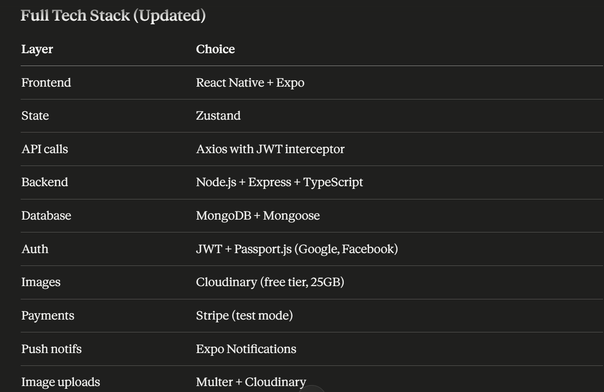

CarMarket/
│
├── 📱 frontend/                          ← React Native (Expo)
│   ├── app.json
│   ├── package.json
│   ├── tsconfig.json
│   ├── babel.config.js
│   │
│   └── src/
│       ├── app/
│       │   ├── _layout.tsx              ← Root navigator
│       │   ├── auth/
│       │   │   ├── LoginScreen.tsx
│       │   │   ├── SignupScreen.tsx
│       │   │   └── OnboardingScreen.tsx
│       │   ├── (tabs)/
│       │   │   ├── _layout.tsx
│       │   │   ├── HomeScreen.tsx
│       │   │   ├── SearchScreen.tsx
│       │   │   ├── CartScreen.tsx
│       │   │   └── ProfileScreen.tsx
│       │   ├── cars/
│       │   │   ├── CarListScreen.tsx
│       │   │   └── CarDetailScreen.tsx
│       │   └── payment/
│       │       └── PaymentScreen.tsx
│       │
│       ├── components/
│       │   ├── ui/
│       │   │   ├── Button.tsx
│       │   │   ├── Input.tsx
│       │   │   ├── Badge.tsx
│       │   │   └── Skeleton.tsx
│       │   ├── cars/
│       │   │   ├── CarCard.tsx
│       │   │   ├── CarImageCarousel.tsx
│       │   │   ├── FeatureBadgeList.tsx
│       │   │   ├── SpecsTable.tsx
│       │   │   └── FilterDrawer.tsx
│       │   ├── seller/
│       │   │   └── SellerCard.tsx
│       │   └── shared/
│       │       ├── NotificationBell.tsx
│       │       ├── VoucherInput.tsx
│       │       └── EmptyState.tsx
│       │
│       ├── store/                       ← Zustand
│       │   ├── authStore.ts             ← user + tokens
│       │   ├── cartStore.ts
│       │   ├── favStore.ts
│       │   └── filterStore.ts
│       │
│       ├── services/
│       │   └── api/
│       │       ├── axiosClient.ts       ← base URL, JWT interceptor
│       │       ├── authApi.ts           ← login, signup, OAuth
│       │       ├── carsApi.ts           ← listings, filters, search
│       │       ├── usersApi.ts          ← profile, favourites
│       │       ├── ordersApi.ts         ← cart, checkout
│       │       ├── paymentApi.ts        ← Stripe intent
│       │       ├── voucherApi.ts
│       │       └── notificationsApi.ts
│       │
│       ├── hooks/
│       │   ├── useAuth.ts
│       │   ├── useSearch.ts
│       │   ├── useFavourites.ts
│       │   ├── useCart.ts
│       │   └── useNotifications.ts
│       │
│       ├── types/
│       │   ├── Car.ts
│       │   ├── User.ts
│       │   ├── Order.ts
│       │   └── Voucher.ts
│       │
│       └── utils/
│           ├── formatPrice.ts
│           ├── tokenStorage.ts          ← SecureStore wrapper
│           ├── debounce.ts
│           └── validators.ts
│
│
└── 🖥️  backend/                          ← Node.js + Express
    ├── package.json
    ├── tsconfig.json
    ├── .env
    ├── .env.example
    │
    └── src/
        ├── server.ts
        ├── app.ts                       ← Express init, middleware
        │
        ├── config/
        │   ├── db.ts                    ← Mongoose connect
        │   ├── passport.ts              ← Google + Facebook strategies
        │   ├── stripe.ts
        │   └── env.ts                   ← typed process.env
        │
        ├── models/                      ← Mongoose schemas
        │   ├── User.model.ts
        │   ├── Car.model.ts
        │   ├── Order.model.ts
        │   ├── Voucher.model.ts
        │   └── Notification.model.ts
        │
        ├── routes/
        │   ├── index.ts
        │   ├── auth.routes.ts           ← /api/auth/*
        │   ├── cars.routes.ts           ← /api/cars/*
        │   ├── orders.routes.ts         ← /api/orders/*
        │   ├── payment.routes.ts        ← /api/payment/*
        │   ├── voucher.routes.ts        ← /api/vouchers/*
        │   └── users.routes.ts          ← /api/users/*
        │
        ├── controllers/
        │   ├── auth.controller.ts
        │   ├── cars.controller.ts
        │   ├── orders.controller.ts
        │   ├── payment.controller.ts
        │   ├── voucher.controller.ts
        │   └── users.controller.ts
        │
        ├── middleware/
        │   ├── verifyJWT.ts             ← protect private routes
        │   ├── errorHandler.ts
        │   ├── rateLimiter.ts
        │   └── upload.ts                ← Multer for image uploads
        │
        ├── services/
        │   ├── authService.ts           ← bcrypt, JWT sign/verify
        │   ├── stripeService.ts
        │   ├── uploadService.ts         ← Cloudinary image upload
        │   └── notificationService.ts  ← Expo push notifications
        │
        └── types/
            ├── express.d.ts             ← extend req.user
            └── models.ts

### Frontend Packages and purpose

# Core navigation
npx expo install expo-router react-native-screens react-native-safe-area-context

# State management
npm install zustand

# Forms & validation
npm install react-hook-form zod @hookform/resolvers

# API calls
npm install axios

# Auth & secure storage
npx expo install expo-secure-store
npm install @react-native-google-signin/google-signin
npx expo install expo-auth-session expo-web-browser

# Styling
npm install nativewind
npm install --save-dev tailwindcss

# UI & animations
npm install react-native-paper
npx expo install react-native-reanimated
npx expo install react-native-gesture-handler

# Image handling
npx expo install expo-image-picker
npx expo install expo-image

# Payments
npm install @stripe/stripe-react-native

# Notifications
npx expo install expo-notifications
npx expo install expo-device

# Sharing & deep links
npx expo install expo-sharing
npx expo install expo-linking

# Phone & SMS (seller contact)
npx expo install expo-phone-number expo-sms

# Misc utilities
npx expo install expo-constants
npx expo install expo-status-bar
npm install dayjs                        # date formatting
npm install react-native-toast-message   # toast alerts

### Backend Packages and purpose
# Init project first
npm init -y
npm install typescript ts-node @types/node --save-dev
npx tsc --init

# Core
npm install express
npm install --save-dev @types/express

# Database
npm install mongoose
npm install --save-dev @types/mongoose

# Auth
npm install jsonwebtoken bcryptjs passport
npm install passport-google-oauth20 passport-facebook passport-jwt passport-local
npm install --save-dev @types/jsonwebtoken @types/bcryptjs @types/passport
npm install --save-dev @types/passport-google-oauth20 @types/passport-facebook

# Image upload
npm install multer cloudinary multer-storage-cloudinary
npm install --save-dev @types/multer

# Payments
npm install stripe

# Security & middleware
npm install cors helmet express-rate-limit
npm install --save-dev @types/cors

# Environment variables
npm install dotenv

# Dev tools
npm install --save-dev nodemon